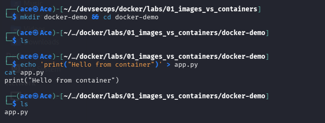
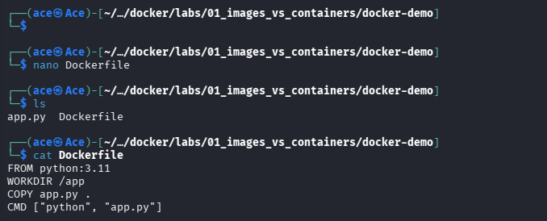
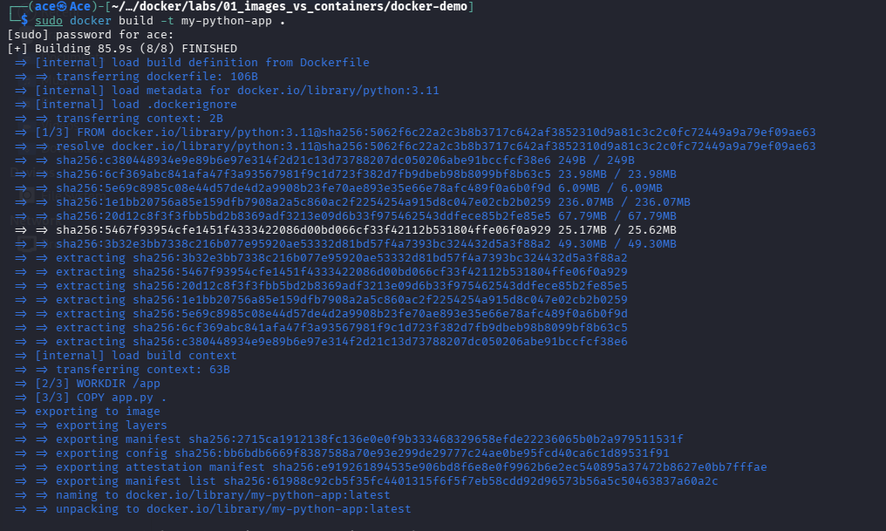
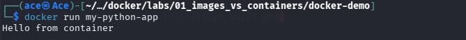
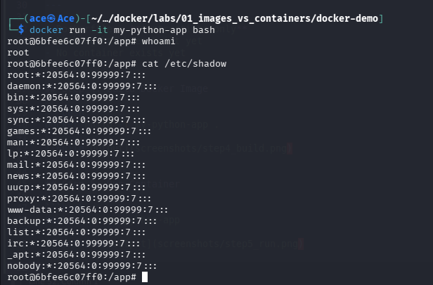

## Step 1: Setup Environment

We create a working directory for the lab:

```bash
mkdir docker-demo && cd docker-demo

Explanation
Creates a new directory for the lab
Sets it as the current working directory


## Step 2: Create Application

We create a simple Python application:

```bash
echo 'print("Hello from container")' > app.py




Explanation
Creates a Python script named app.py
The script prints a message when executed
Key Concept

The application represents the code we want to run inside the container.


## Step 3: Create Dockerfile

```dockerfile
FROM python:3.11
WORKDIR /app
COPY app.py .
CMD ["python", "app.py"]



---
Explanation
FROM → base image with Python runtime
WORKDIR → sets working directory
COPY → adds application
CMD → defines runtime command
Key Concept
Dockerfile = instructions only
Nothing has been built yet
No container exists yet
---
## Step 4: Build Docker Image

```bash
docker build -t my-python-app .



Explanation
docker build tells Docker to build an image
-t my-python-app assigns a name (tag) to the image
. specifies the current directory as the build context

During this process:

Docker reads the Dockerfile
Executes each instruction step-by-step
Creates layers for each instruction
Produces a final image
Key Concept

Dockerfile → (docker build) → Image

The image is immutable, meaning it cannot be modified after it is created.


## Step 5: Run Container

```bash
docker run my-python-app




Explanation
docker run creates and starts a container from an image
my-python-app is the image we built in the previous step

When this command is executed:

Docker checks if the image exists locally
It creates a new container from the image
It adds a temporary writable layer on top of the image

It executes the command defined in the Dockerfile:

python app.py
Output

The container runs the application and prints:

Hello from container

Key Concepts
Image → blueprint (immutable)
Container → running instance of the image
Each docker run creates a new container
Important Insight

The container is not the image itself.
It is a separate runtime instance created from the image.

Every time docker run is executed:

A new container is created
It starts from a clean state


## Step 6: Run Interactive Container

```bash
docker run -it my-python-app bash



Explanation
-it enables interactive mode:
-i keeps input open
-t provides a terminal
bash starts a shell inside the container

This allows us to directly interact with the container’s environment.

What Happens Internally

When this command runs:

Docker creates a new container from the image
A temporary writable layer is added on top of the image
Instead of running the default command, it starts a bash shell
We are now operating inside the container
Key Concept

This step allows us to interact with the container's runtime layer, not the image itself.

All changes made here will exist only inside this container.


## Step 7: Modify Container and Verify Ephemeral Behavior

Inside the container:

```bash
touch newfile.txt
ls


Explanation
The file newfile.txt existed in the first container
After exiting and starting a new container, the file is no longer present
Key Concept: Ephemeral Containers

Containers are temporary by design.

Changes made inside a container are stored in a writable layer
This layer is removed when the container is deleted
A new container starts from the original image state
Important Insight
The image remains unchanged
Each container is independent
Data does not persist unless explicitly stored (e.g., using volumes)


## Step 8: Summary and Key Takeaways

### What We Did

- Created a simple Python application
- Defined a Dockerfile to package the application
- Built a Docker image from the Dockerfile
- Ran containers from the image
- Interacted with a container and modified its state
- Verified that changes inside the container do not persist

---

### Core Relationship

Dockerfile → Image → Container

- Dockerfile defines how the image is built
- Image is an immutable blueprint
- Container is a running instance of the image

---

### Key Concepts

#### 1. Image (Immutable)

- Built from a Dockerfile
- Cannot be modified after creation
- Used as a template to create containers

---

#### 2. Container (Ephemeral)

- Created from an image
- Has a temporary writable layer
- Can be started, stopped, and removed
- Changes do not persist across containers

---

#### 3. Build vs Run

- `docker build` → creates an image
- `docker run` → creates and starts a container

---

### Important Insight

Each time a container is created:
- It starts from the same image
- It does not retain changes from previous containers

---

### Conclusion

This lab demonstrates the fundamental behavior of Docker:

- Images provide a consistent, reproducible environment
- Containers provide isolated, temporary execution

Understanding this distinction is essential for working with Docker and DevSecOps workflows.