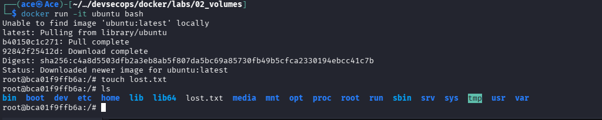
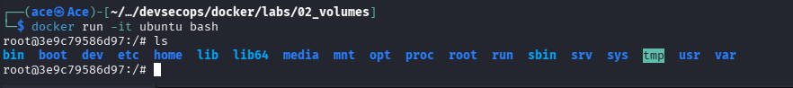
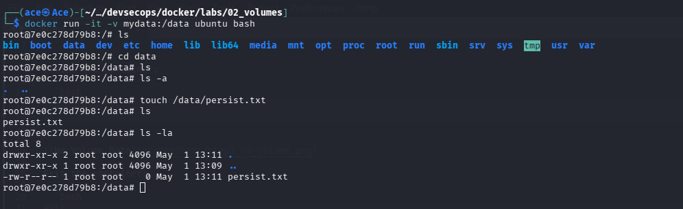
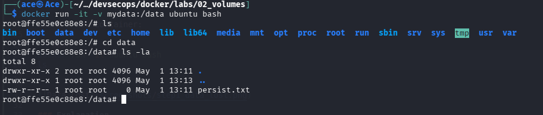
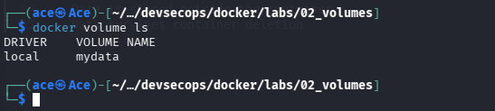
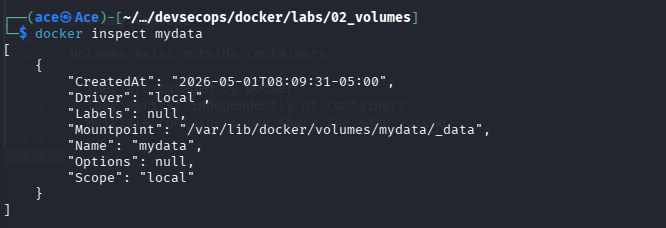
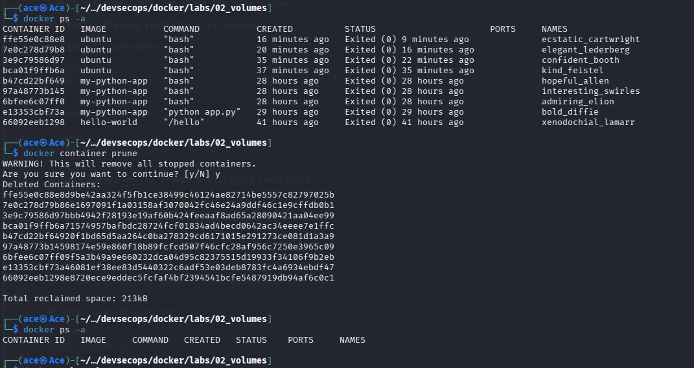
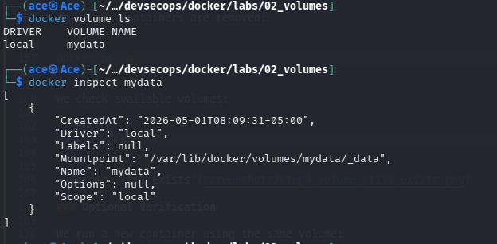

## Step 1: Container Without Volume (Data Loss)

We start a container without any persistent storage.

```bash
docker run -it ubuntu bash
```

Inside the container:

```bash
touch lost.txt
ls
```



Exit the container:

```bash
exit
```

Start a new container:

```bash
docker run -it ubuntu bash
ls
```



### Explanation

- A file `lost.txt` was created inside the first container  
- After exiting and starting a new container, the file is gone  

### Key Concept

Containers are ephemeral:

- Data is stored in a temporary writable layer  
- When the container is removed, the data is lost  


## Step 2: Using a Volume (Persistent Data)

We create a container with a Docker volume.

```bash
docker run -it -v mydata:/data ubuntu bash
```

Inside the container:

```bash
touch /data/persist.txt
ls /data
```



Exit the container:

```bash
exit
```

Start a new container using the same volume:

```bash
docker run -it -v mydata:/data ubuntu bash
ls /data
```



### Explanation

- `-v mydata:/data` creates and mounts a Docker volume  
- `mydata` is the volume name  
- `/data` is the directory inside the container  

When the file is created:
- It is stored in the volume, not the container  

After restarting:
- The file still exists  

### Key Concept

Volumes provide persistent storage:

- Data is stored outside the container  
- Data survives container deletion  

## Step 3: Inspect and Manage Volumes

We list all Docker volumes:

```bash
docker volume ls
```



We inspect the specific volume:

```bash
docker volume inspect mydata
```



### Explanation

- `docker volume ls` shows all available volumes  
- `docker volume inspect mydata` provides detailed information about the volume  

The inspect output includes:

- Mountpoint → where the data is stored on the host system  
- Name → volume identifier  
- Driver → storage driver used  

### Key Concept

Volumes exist outside containers:

- They are managed by Docker  
- They persist independently of containers  
- Multiple containers can share the same volume  

## Step 4: Cleanup (Containers vs Volumes)

We list all containers:

```bash
docker ps -a
```

We remove a container:

```bash
docker rm <container_id>
```

Alternatively, we can remove all stopped containers:

```bash
docker container prune
```

We verify containers are removed:

```bash
docker ps -a
```

We check available volumes:

```bash
docker volume ls
```



### Optional Verification

We run a new container using the same volume:

```bash
docker run -it -v mydata:/data ubuntu bash
ls /data
```

This confirms that the data still exists inside the volume.

### Removing the Volume

```bash
docker volume rm mydata
```

Verify removal:

```bash
docker volume ls
```



### Explanation

- Removing containers does NOT remove associated volumes  
- Volumes persist independently of containers  
- Volumes must be removed manually  

### Key Concept

Containers and volumes are independent:

- Containers are ephemeral and can be deleted safely  
- Volumes provide persistent storage  

### Important Insight

- Data stored in volumes survives container deletion  
- Even after removing all containers, the volume still exists  
- This is how Docker supports persistent storage in real-world applications  

