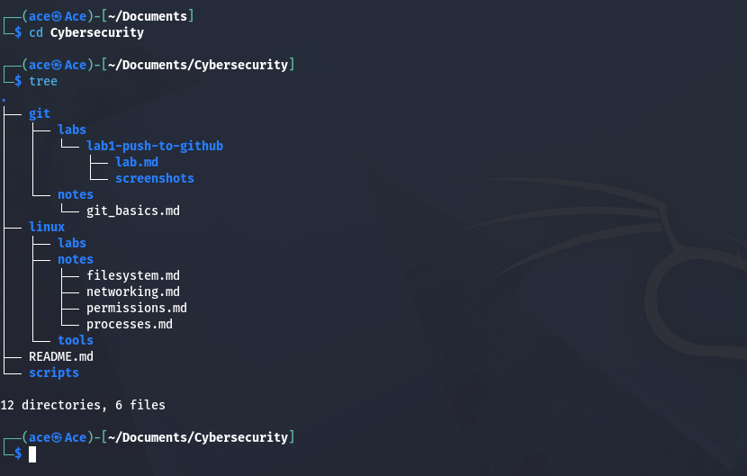
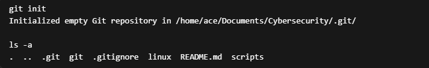
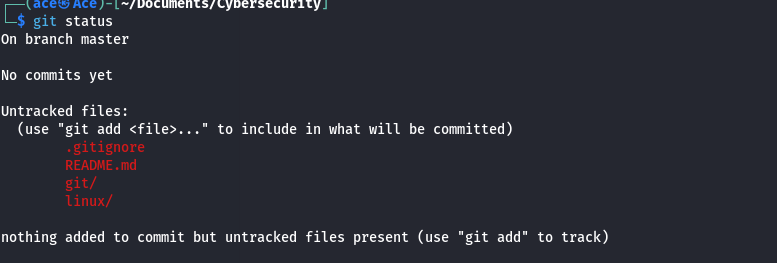
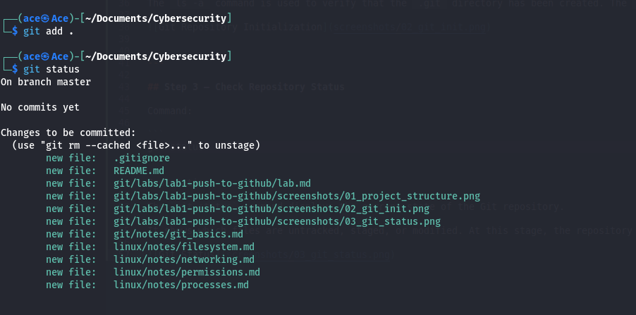
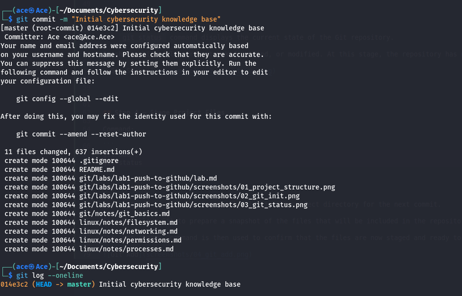
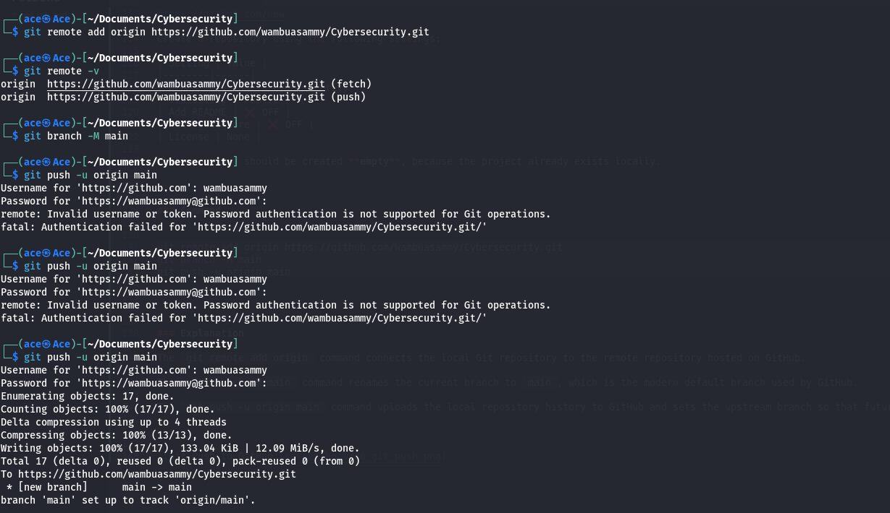

# Lab 1 — Push Local Repository to GitHub

## Objective

The goal of this lab is to initialize a Git repository locally and publish it to GitHub.

---

## Step 1 — Verify Project Structure

Before initializing Git, we verify the current project directory structure.

Command:

tree ~/Documents/Cybersecurity

Explanation:

This command displays the directory hierarchy of the project. It confirms that the repository contains the Linux notes, Git documentation, scripts, and supporting directories.




---

## Step 2 — Initialize the Git Repository

Command:

Explanation:

The `git init` command initializes a new Git repository in the project directory.

Git creates a hidden directory called `.git` which contains the repository metadata, commit history, and configuration.

The `ls -a` command is used to verify that the `.git` directory has been created. The `-a` option displays hidden files and directories.




---

## Step 3 — Check Repository Status

Command:

```
git status
```

Explanation:

The `git status` command displays the current state of the Git repository.

It shows which files are untracked, staged, or modified. At this stage, the repository has not yet tracked any files, so Git reports the project files as untracked.




---

## Step 4 — Stage Project Files

Command:

```
git add .
git status
```

Explanation:

The `git add .` command stages all files in the project directory for the next commit.

Staging allows Git to prepare a snapshot of the files that will be included in the repository history.

The `git status` command is then used to confirm that the files are now staged and ready to be committed.




---

## Step 5 — Create the First Commit

Command:

```
git commit -m "Initial cybersecurity knowledge base"
git log --oneline
```

Explanation:

The `git commit` command records the staged files as a snapshot in the repository history.

The `-m` option allows specifying a commit message describing the change.

The `git log --oneline` command displays the commit history in a simplified format and confirms that the commit was successfully created.




---

## Step 6 — Push the Repository to GitHub

Before pushing the local repository, a remote repository must first be created on GitHub.

Navigate to:

https://github.com/new

Create a repository using the following settings:

| Setting | Value |
|--------|------|
| Repository name | Cybersecurity |
| Visibility | Public |
| Add README | ❌ OFF |
| Add .gitignore | ❌ OFF |
| License | None |

The repository should be created **empty**, because the project already exists locally.

---

### Command

```
git remote add origin https://github.com/wambuasammy/Cybersecurity.git
git branch -M main
git push -u origin main
```

---

### Explanation

The `git remote add origin` command connects the local Git repository to the remote repository hosted on GitHub.

The `git branch -M main` command renames the current branch to `main`, which is the modern default branch used by GitHub.

The `git push -u origin main` command uploads the local repository history to GitHub and sets the upstream branch so that future pushes can be performed simply using `git push`.

---

