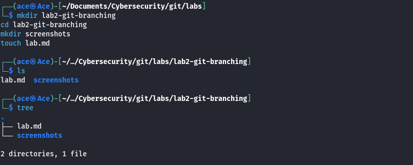
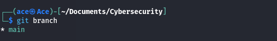
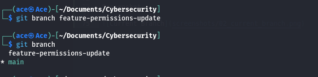
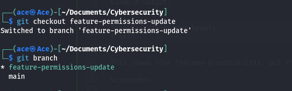
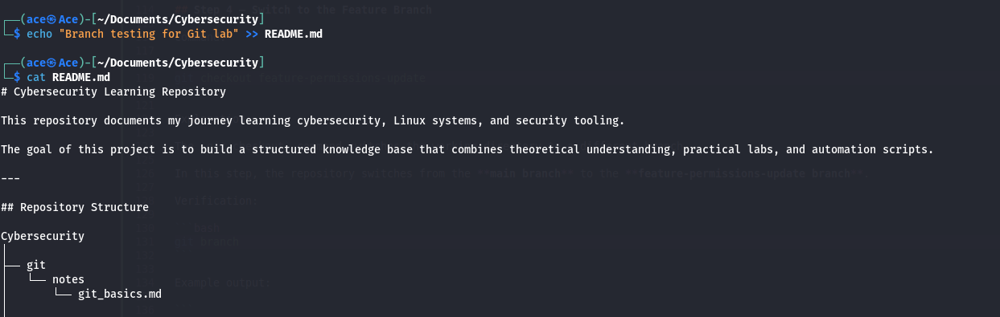
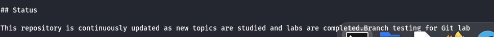
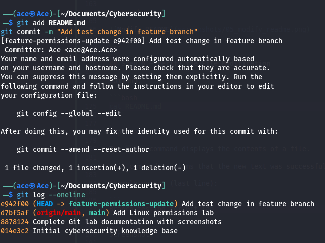
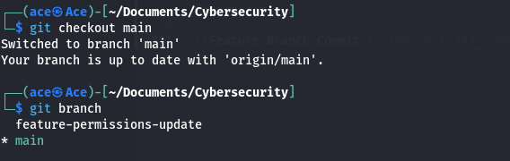
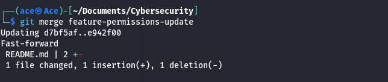
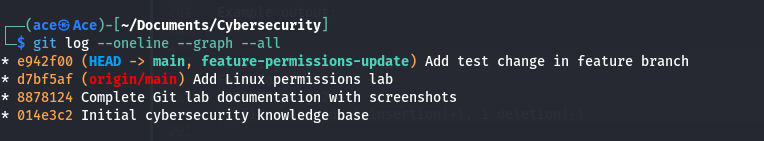

# Lab 2 — Git Branching Workflow

## Table of Contents

- [Objective](#objective)
- [Step 1 — Create Lab Structure](#step-1--create-lab-structure)
- [Step 2 — Check Current Branch](#step-2--check-current-branch)
- [Step 3 — Create Branch](#step-3--create-branch)
- [Step 4 — Switch Branch](#step-4--switch-branch)
- [Step 5 — Modify File](#step-5--modify-file)
- [Step 6 — Verify Change](#step-6--verify-change)
- [Step 7 — Commit Change](#step-7--commit-change)
- [Step 8 — Switch Back to Main](#step-8--switch-back-to-main)
- [Step 9 — Merge Branch](#step-9--merge-branch)
- [Step 10 — Visualize Commit History](#step-10--visualize-commit-history)
- [Step 11 — Publish the Lab](#step-11--publish-the-lab)
- [Conclusion](#conclusion)

---

## Objective

The objective of this lab is to understand how Git branches work and how they can be used to develop features safely without affecting the main branch.

---

## Step 1 — Create the Lab Structure

Commands:

```bash
mkdir lab2-git-branching
cd lab2-git-branching
mkdir screenshots
touch lab.md
```

Explanation:

These commands create the directory structure for the Git branching lab.

- `mkdir lab2-git-branching` creates the lab directory
- `cd lab2-git-branching` moves into the directory
- `mkdir screenshots` creates a folder for lab screenshots
- `touch lab.md` creates the documentation file

Verification:

```bash
tree
```

Example output:

```
.
├── lab.md
└── screenshots

2 directories, 1 file
```

Screenshot:



---

## Step 2 — Check Current Branch

Command:

```bash
git branch
```

Explanation:

The `git branch` command lists all branches in the repository and indicates the currently active branch.

The `*` symbol shows the branch that is currently checked out.

Example output:

```
* main
```

This means the repository is currently on the **main branch**, which is the primary branch used for development.

Screenshot:



---

## Step 3 — Create a New Branch

Command:

```bash
git branch feature-permissions-update
```

Explanation:

The `git branch` command creates a new branch in the repository.

In this case, a branch called **feature-permissions-update** is created.

Verification:

```bash
git branch
```

Example output:

```
feature-permissions-update
* main
```

This shows that the new branch exists, but the repository is still on the **main branch**.

Screenshot:



---

## Step 4 — Switch to the Feature Branch

Command:

```bash
git checkout feature-permissions-update
```

Explanation:

The `git checkout` command switches the working directory to a different branch.

In this step, the repository switches from the **main branch** to the **feature-permissions-update branch**.

Verification:

```bash
git branch
```

Example output:

```
* feature-permissions-update
  main
```

The `*` indicates the currently active branch.

Screenshot:



---

## Step 5 — Modify a File in the Feature Branch

Command:

```bash
echo "Branch testing for Git lab" >> README.md
```

Explanation:

The `echo` command prints text to the terminal.  
Using `>>` appends the text to the end of a file.

In this step, a new line is added to `README.md` while working inside the **feature-permissions-update** branch.

Screenshot:



---

## Step 6 — Verify the File Modification

Command:

```bash
cat README.md
```

Explanation:

The `cat` command displays the contents of a file.

This command confirms that the new text was successfully appended to the end of `README.md`.

Example output (last line):

```
Branch testing for Git lab
```

Screenshot:




---

## Step 7 — Commit Changes in the Feature Branch

Commands:

```bash
git add README.md
git commit -m "Add test change in feature branch"
```

Explanation:

The `git add` command stages changes for the next commit.

The `git commit` command saves the changes in the repository history with a descriptive message.

This commit is created while working inside the **feature-permissions-update branch**, meaning the change only exists in that branch.

Verification:

```bash
git log --oneline
```

Example output:

```
e94f00 (HEAD -> feature-permissions-update) Add test change in feature branch
d7bf5af (origin/main, main) Add Linux permissions lab
8878124 Complete Git lab documentation with screenshots
014e3c2 Initial cybersecurity knowledge base
```

Screenshot:



---

## Step 8 — Switch Back to the Main Branch

Command:

```bash
git checkout main
```

Explanation:

The `git checkout` command switches the working directory to another branch.

In this step, the repository switches from the **feature-permissions-update branch** back to the **main branch**.

Verification:

```bash
git branch
```

Example output:

```
feature-permissions-update
* main
```

The `*` indicates the currently active branch.

Screenshot:



---

## Step 9 — Merge the Feature Branch

Command:

```bash
git merge feature-permissions-update
```

Explanation:

The `git merge` command integrates changes from one branch into another.

In this step, the changes made in the **feature-permissions-update branch** are merged into the **main branch**.

Example output:

```
Updating d7bf5af..e942f00
Fast-forward
 README.md | 2 +-
 1 file changed, 1 insertion(+), 1 deletion(-)
```

Explanation of the output:

- **Fast-forward** indicates that Git simply moved the `main` branch pointer forward to include the commits from the feature branch.
- The file `README.md` was updated with the change made in the feature branch.

Screenshot:



---

## Step 10 — Visualize the Commit History

Command:

```bash
git log --oneline --graph --all
```

Explanation:

The `git log` command displays the commit history.

Options used:

- `--oneline` shows each commit in a compact format
- `--graph` displays the commit structure as a graph
- `--all` shows commits from all branches

Example output:

```
* e942f00 (HEAD -> main, feature-permissions-update) Add test change in feature branch
* d7bf5af (origin/main) Add Linux permissions lab
* 8878124 Complete Git lab documentation with screenshots
* 014e3c2 Initial cybersecurity knowledge base
```

This confirms that the commit created in the **feature branch** has been successfully merged into the **main branch**.

Screenshot:



---

## Step 11 — Publish the Lab to GitHub

Commands:

```bash
git add .
git commit -m "Add Git branching lab"
git push
```

Explanation:

These commands publish the completed lab to the remote repository.

- `git add .` stages all modified and newly created files.
- `git commit` records the changes in the repository history with a descriptive message.
- `git push` uploads the commits to the remote repository hosted on GitHub.

This step ensures that the lab documentation, screenshots, and changes made during the branching workflow are saved and available in the remote repository.

Example output:

```
[main 2b4f1c3] Add Git branching lab
 6 files changed, 120 insertions(+)
 create mode 100644 git/labs/lab2-git-branching/lab.md
```

---

## Conclusion

In this lab, we explored the Git branching workflow and demonstrated how branches enable safe and organized development.

A new branch called `feature-permissions-update` was created using `git branch`, and the working directory was switched to that branch using `git checkout`. While working in the feature branch, a modification was made to the `README.md` file, and the change was committed to the repository.

After completing the work in the feature branch, the repository was switched back to the `main` branch and the changes were integrated using the `git merge` command. The commit history was then inspected using `git log --oneline --graph --all`, confirming that the feature branch changes were successfully merged into the main branch.

Finally, the completed lab documentation and screenshots were published to the remote repository using `git add`, `git commit`, and `git push`.

This lab demonstrates the fundamental Git branching workflow used in real development environments, where new features are developed in isolated branches and later merged into the main codebase once completed.