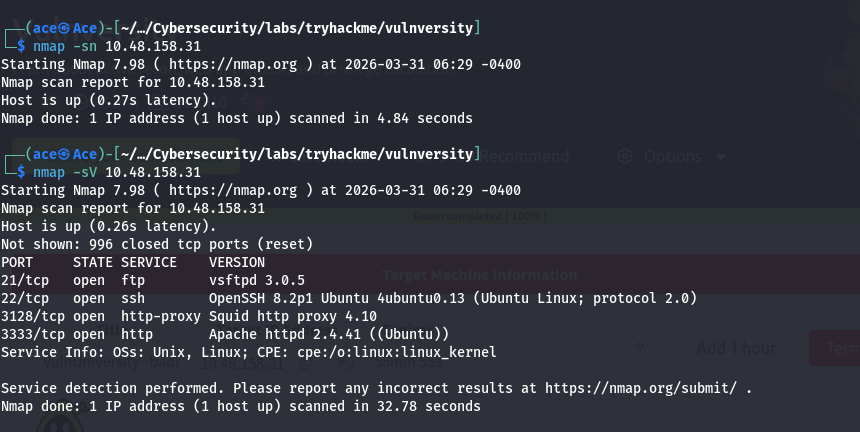

# TryHackMe — Vulnversity

## Lab Type

Web exploitation + enumeration + privilege escalation

---

## Objective

The objective of this lab is to simulate a real-world attack scenario by:

* Discovering open services on a target machine
* Enumerating web directories and application functionality
* Identifying and exploiting a vulnerability
* Gaining initial access to the system
* Escalating privileges to gain higher-level access

---

## Lab Overview

This lab represents a vulnerable web application hosted on a target machine.

The attacker (you) must:

* Perform reconnaissance to identify exposed services
* Use enumeration techniques to discover hidden attack surfaces
* Exploit a web-based vulnerability
* Gain remote access via a reverse shell
* Perform privilege escalation

---

## Methodology

This lab will be approached using a structured penetration testing workflow:

1. Reconnaissance
2. Scanning
3. Enumeration
4. Exploitation
5. Post-Exploitation
6. Privilege Escalation

---

## Tools Expected to Be Used

* nmap → service and port discovery
* gobuster → directory enumeration
* browser → web interaction
* netcat → reverse shell listener
* Linux commands → system enumeration
* find → privilege escalation checks

---

## Rules for Execution

* Every command must have a clear purpose
* Results must be analyzed before moving forward
* No blind execution of commands
* Document findings as they occur
* Focus on understanding, not speed

---

## Success Criteria

The lab is considered successful when:

* Open services are identified and understood
* Hidden directories and entry points are discovered
* A working exploit is achieved
* Shell access is obtained
* Privilege escalation is performed
* All steps can be explained clearly

---

## Notes

This lab will be treated as a real-world scenario, not a guided exercise.
All actions will be documented and mapped to core cybersecurity concepts.

## Phase 2 — Scanning

### Command Used

nmap -sV -sC 10.48.158.31

### Screenshot

### Open Ports

- 21 → FTP (vsftpd 3.0.5)
- 22 → SSH (OpenSSH 8.2p1)
- 3128 → Squid Proxy
- 3333 → HTTP (Apache)

