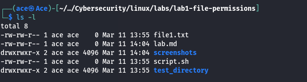
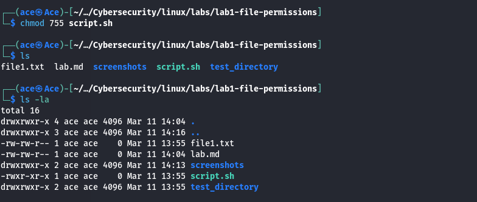
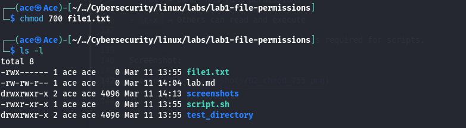
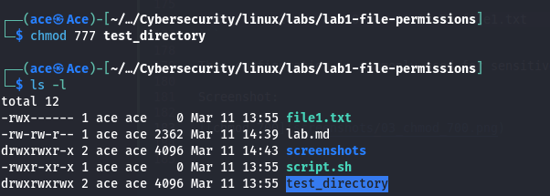

# Lab 1 — Linux File Permissions

## Objective

The objective of this lab is to understand how Linux file permissions work and how they can be inspected using the `ls -l` command.
## Lab Environment

System: Kali Linux  
Shell: Bash  
Tools Used: `ls`, `chmod`, `touch`, `mkdir`

---

## Step 1 — Create Test Files

Command:

```bash
touch file1.txt
touch script.sh
mkdir test_directory
```

Explanation:

These commands create files and a directory that will be used to demonstrate Linux file permissions.

- `touch` creates empty files.
- `mkdir` creates a directory.

Verification:

```bash
ls
```

Example output:

```
file1.txt
script.sh
test_directory
```

---

## Step 2 — Inspect File Permissions

Command:

```bash
ls -l
```

Explanation:

The `ls -l` command lists files and directories in **long format**, displaying detailed information such as file permissions, ownership, file size, and modification time.

Example output:

```
-rw-rw-r-- 1 ace ace 0 Mar 11 13:55 file1.txt
-rw-rw-r-- 1 ace ace 0 Mar 11 14:04 lab.md
drwxrwxr-x 2 ace ace 4096 Mar 11 14:04 screenshots
-rw-rw-r-- 1 ace ace 0 Mar 11 13:55 script.sh
drwxrwxr-x 2 ace ace 4096 Mar 11 13:55 test_directory
```

Explanation of the permission string:

```
-rw-rw-r--
```

Breakdown:

| Section | Meaning |
|---|---|
`-` | File type (`-` = file, `d` = directory) |
`rw-` | Owner permissions |
`rw-` | Group permissions |
`r--` | Others permissions |

Example:

```
drwxrwxr-x
```

| Section | Meaning |
|---|---|
`d` | Directory |
`rwx` | Owner permissions |
`rwx` | Group permissions |
`r-x` | Others permissions |

Screenshot:




---

## Step 3 — Modify File Permissions

Command:

```bash
chmod 755 script.sh
```

Explanation:

The `chmod` command is used to modify file permissions.

The permission value `755` means:

| Value | Permission | Description |
|------|------|------|
7 | rwx | Owner can read, write, and execute |
5 | r-x | Group can read and execute |
5 | r-x | Others can read and execute |

After applying the command, we verify the change using:

```bash
ls -la
```

Example output:

```
-rwxr-xr-x 1 ace ace 0 Mar 11 13:55 script.sh
```

Explanation:

- `rwx` → Owner has full permissions
- `r-x` → Group can read and execute
- `r-x` → Others can read and execute

This makes the file executable, which is required for scripts.

Screenshot:




---

## Step 4 — Restrict File Access

Command:

```bash
chmod 700 file1.txt
```

Explanation:

The `chmod 700` command restricts file access so that only the owner can read, write, or execute the file.

Permission breakdown:

| Value | Permission | Description |
|------|------|------|
7 | rwx | Owner has full access |
0 | --- | Group has no access |
0 | --- | Others have no access |

Verification:

```bash
ls -l
```

Example output:

```
-rwx------ 1 ace ace 0 Mar 11 13:55 file1.txt
```

This configuration is commonly used for sensitive files such as SSH private keys.

Screenshot:




---

## Step 5 — Demonstrate Insecure Permissions

Command:

```bash
chmod 777 test_directory
```

Explanation:

The `chmod 777` command grants full permissions to all users.

Permission breakdown:

| Value | Permission | Description |
|---|---|---|
7 | rwx | Owner has full access |
7 | rwx | Group has full access |
7 | rwx | Others have full access |

Verification:

```bash
ls -l
```

Example output:

```
drwxrwxrwx 2 ace ace 4096 Mar 11 13:55 test_directory
```

Security Note:

Using `777` permissions is considered insecure because it allows any user on the system to modify the directory.

Screenshot:



---

## Conclusion

In this lab we explored how Linux file permissions work and how they can be modified using the `chmod` command.

Key concepts demonstrated:

- Viewing permissions using `ls -l`
- Making scripts executable with `chmod 755`
- Restricting access using `chmod 700`
- Understanding why `chmod 777` is insecure

Understanding file permissions is essential for Linux administration and system security.
