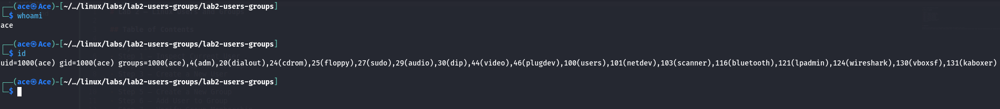
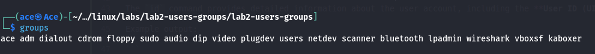
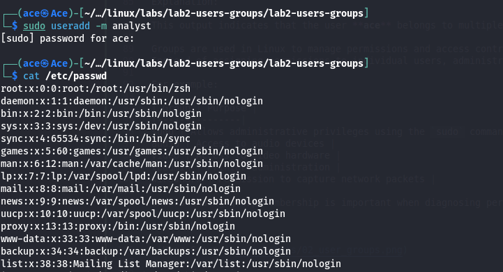
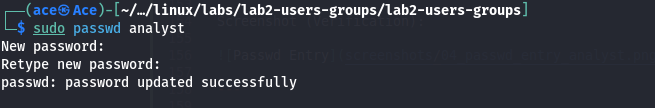
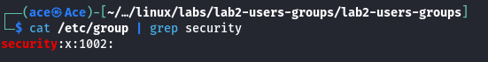
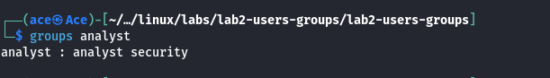
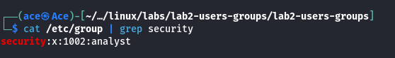
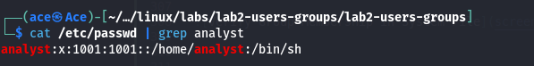
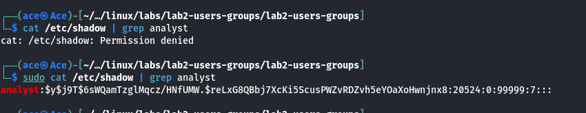

# Lab 2 — Linux Users and Groups

## Table of Contents

- Objective
- Step 1 — Inspect Current User
- Step 2 — View Group Membership
- Step 3 — Create a New User
- Step 4 — Set User Password
- Step 5 — Create a New Group
- Step 6 — Add User to Group
- Step 7 — Verify Group Membership
- Step 8 — Inspect System Files
- Conclusion

---

## Objective

The objective of this lab is to understand how Linux manages user accounts and groups.  
In this lab we will create users, create groups, assign users to groups, and inspect system configuration files that store authentication and account information.

---

## Step 1 — Inspect Current User Identity

Commands:

`whoami`

`id`

Explanation:

The `whoami` command displays the username of the currently logged-in user.

Example output:

```
ace
```

The `id` command provides detailed information about the user account, including the **User ID (UID)**, **Group ID (GID)**, and the groups the user belongs to.

Example output:

```
uid=1000(ace) gid=1000(ace) groups=1000(ace),4(adm),20(dialout),24(cdrom),25(floppy),27(sudo),29(audio),30(dip),44(video),46(plugdev),100(users),101(netdev),103(scanner),116(bluetooth),121(lpadmin),124(wireshark),130(vboxsf),131(kaboxer)
```

Explanation of important fields:

| Field | Meaning |
|------|--------|
UID | Unique identifier assigned to the user |
GID | Primary group ID of the user |
Groups | Additional groups the user belongs to |

This command helps administrators verify **user identity and group membership**, which is important for managing permissions and troubleshooting access control issues.

Screenshot:



---

---

## Step 2 — Inspect Group Membership

Command:

`groups`

Explanation:

The `groups` command displays the groups that the current user belongs to.

Example output:

```
ace adm dialout cdrom floppy sudo audio dip video plugdev users netdev scanner bluetooth lpadmin wireshark vboxsf kaboxer
```

Explanation:

This output indicates that the user **ace** belongs to multiple groups on the system.

Groups are used in Linux to manage permissions and access control.  
Instead of assigning permissions to individual users, administrators can assign permissions to groups, and all users within the group inherit those permissions.

For example:

| Group | Purpose |
|------|--------|
sudo | Allows administrative privileges using the `sudo` command |
audio | Access to audio devices |
video | Access to video hardware |
lpadmin | Printer administration |
wireshark | Permission to capture network packets |

Understanding group membership is important when diagnosing permission issues or managing system access.

Screenshot:



---

---

## Step 3 — Create a New User

Command:

`sudo useradd -m analyst`

Explanation:

The `useradd` command is used to create a new user account in Linux.

The `-m` option instructs the system to create a home directory for the user.

In this case, the command creates a new user named **analyst** and automatically generates the home directory:

```
/home/analyst
```

Screenshot (Command):



---

### Verify User Creation

Command:

`cat /etc/passwd`

Explanation:

The `/etc/passwd` file stores information about user accounts on the system.

After creating the new user, we inspect this file to confirm that the user **analyst** has been added to the system.

Example entry:

```
analyst:x:1001:1001::/home/analyst:/bin/sh
```

Screenshot (Verification):


---

---

## Step 4 — Set Password for the New User

Command:

`sudo passwd analyst`

Explanation:

The `passwd` command is used to set or update the password for a user account.

In this step, we assign a password to the newly created user **analyst**.

When executed, the system prompts the administrator to enter and confirm the password.

Example interaction:

```
New password:
Retype new password:
passwd: password updated successfully
```

Linux stores encrypted password hashes inside the `/etc/shadow` file, which is restricted to root access for security purposes.

Screenshot:



---

---

## Step 5 — Create a New Group

Command:

`sudo groupadd security`

Explanation:

The `groupadd` command is used to create a new group on the Linux system.

In this step, a group named **security** is created. Groups allow administrators to assign permissions to multiple users at once.

Screenshot (Command):


---

### Verify Group Creation

Command:

`cat /etc/group | grep security`

Explanation:

The `/etc/group` file stores group definitions and group membership information.

Using `grep`, we search for the newly created group **security** to confirm that it was successfully added.

Example output:

```
security:x:1002:
```

This entry confirms that the group exists but currently has no members assigned to it.

Screenshot (Verification):



---

---

## Step 6 — Add User to the Group

Command:

`sudo usermod -aG security analyst`

Explanation:

The `usermod` command modifies an existing user account.

The `-aG` option appends the user to a supplementary group without removing the user from existing groups.

In this step, the user **analyst** is added to the **security** group.

Screenshot (Command):


---

### Verify Group Membership

Command:

`groups analyst`

Explanation:

The `groups` command displays the groups that a user belongs to.

Example output:

```
analyst : analyst security
```

This confirms that the user **analyst** is now a member of the **security** group.

Screenshot (Verification):



---

---

## Step 7 — Inspect Group Information in System Files

Command:

`cat /etc/group | grep security`

Explanation:

The `/etc/group` file stores information about all groups on the system, including group IDs and group membership.

By using the `grep` command, we filter the output to display only the entry related to the **security** group.

Example output:

```
security:x:1002:analyst
```

This confirms that the group **security** exists and that the user **analyst** has been successfully added to it.

Screenshot:



---

---

## Step 8 — Inspect Authentication System Files

### Inspect `/etc/passwd`

Command:

`cat /etc/passwd | grep analyst`

Explanation:

The `/etc/passwd` file stores information about user accounts on the Linux system.

Each line represents a user and contains fields such as the username, user ID (UID), group ID (GID), home directory, and login shell.

Example output:

```
analyst:x:1001:1001::/home/analyst:/bin/sh
```

Screenshot:



---

### Inspect `/etc/shadow`

Command:

`sudo cat /etc/shadow | grep analyst`

Explanation:

The `/etc/shadow` file stores encrypted password hashes for user accounts.

This file is restricted to root access because it contains sensitive authentication information.

Example output:

```
analyst:$y$j9T$...hash...:19810:0:99999:7:::
```

Screenshot:



---

---

## Conclusion

In this lab, we explored how Linux manages user accounts and group membership.

We began by inspecting the identity of the current user using the `whoami`, `id`, and `groups` commands. These commands help administrators and security professionals understand which user is currently active and which groups the user belongs to.

Next, we created a new user account named **analyst** using the `useradd` command and assigned a password using the `passwd` command. This demonstrated how new accounts are added to a Linux system.

We then created a new group called **security** using the `groupadd` command and added the user **analyst** to that group using `usermod -aG`. This step illustrated how Linux uses groups to manage permissions for multiple users efficiently.

After modifying group membership, we verified the changes using the `groups` command and by inspecting the `/etc/group` file.

Finally, we examined the `/etc/passwd` and `/etc/shadow` files to understand how Linux stores user account information and password hashes. These files form the core of the Linux authentication system and are critical for system security.

Through this lab, we gained practical experience with:

- user account creation
- password management
- group creation and membership management
- Linux authentication system files

Understanding these mechanisms is essential for **Linux system administration, access control, and cybersecurity operations**, as improper user or group configurations can lead to privilege escalation vulnerabilities.

---