# Lab 3 — Linux Process Management

## Introduction

Linux systems run many programs simultaneously. Each running program is known as a **process**.
Processes consume system resources such as CPU time and memory, and administrators must be able to monitor, control, and terminate them when necessary.

Understanding how processes work is an essential skill for Linux administrators and cybersecurity professionals. Suspicious or malicious activity on a system often appears as unexpected or abnormal processes.

In this lab, we will explore how to create background processes, inspect running processes, and terminate them using common Linux commands.

---

## Objective

The objective of this lab is to understand how Linux manages running processes and how administrators can monitor and control them.

By the end of this lab, you will be able to:

* create background processes
* inspect running processes
* monitor processes using Linux commands
* terminate processes using process management tools
* verify process termination

---

## Table of Contents

- [Introduction](#introduction)
- [Objective](#objective)
- [Step 1 — Start a Background Process](#step-1--start-a-background-process)
- [Step 2 — View Background Jobs](#step-2--view-background-jobs)
- [Step 3 — Inspect the Running Process](#step-3--inspect-the-running-process)
- [Step 4 — Terminate the Process](#step-4--terminate-the-process)
- [Step 5 — Verify Process Termination](#step-5--verify-process-termination)
- [Step 6 — Monitor Processes with top](#step-6--monitor-processes-with-top)
- [Step 7 — Monitor Processes with htop](#step-7--monitor-processes-with-htop)
- [Step 8 — Terminate Processes with killall](#step-8--terminate-processes-with-killall)
- [Step 9 — Terminate Processes with pkill](#step-9--terminate-processes-with-pkill)
- [Step 10 — Resume Background Jobs with fg and bg](#step-10--resume-background-jobs-with-fg-and-bg)
- [Step 11 — Change Process Priority with nice](#step-11--change-process-priority-with-nice)
- [Step 12 — Modify Process Priority with renice](#step-12--modify-process-priority-with-renice)
- [Conclusion](#conclusion)

---
---

## Step 1 — Start a Background Process

Command:

```
sleep 600 &
```

Explanation:

The `sleep` command pauses execution for a specified number of seconds.

In this example, the process will run for **600 seconds (10 minutes)**.

The `&` symbol runs the command in the **background**, allowing the terminal to remain usable while the process continues running.

Example output:

```
[1] 48381
```

Where:

| Value | Meaning |
|------|------|
[1] | Job number |
54858 | Process ID (PID) |

Screenshot:

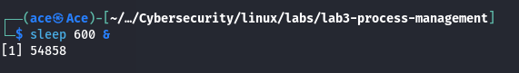

---

## Step 2 — View Background Jobs

Command:

```
jobs
```

Explanation:

The `jobs` command displays background jobs started from the current terminal session.

Example output:

```
[1]+ Running sleep 600 &
```

This confirms that the background process created earlier is currently running.

Screenshot:

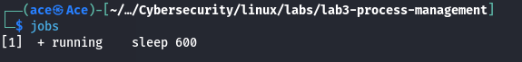

---

## Step 3 — Inspect the Running Process

Command:

```
ps aux | grep sleep
```

Explanation:

The `ps` command displays information about running processes on the system.

Using `grep sleep` filters the output to show only processes containing the word **sleep**.

Example output:

```
ace 54858 0.0 0.0 5588 2208 pts/1 SN 13:38 0:00 sleep 600
ace 56562 0.0 0.0 6544 2504 pts/1 S+ 13:42 0:00 grep --color=auto sleep
```

The important process is:

```
sleep 600
```

This confirms that the background process created earlier is running on the system.

The `grep sleep` process appears because the search command itself contains the word **sleep**.

Screenshot:

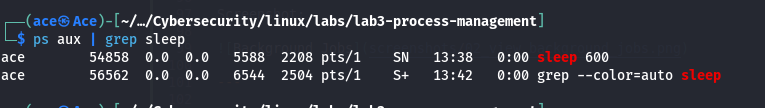

---

## Step 4 — Terminate the Process

Command:

```
kill 54858
```

Explanation:

The `kill` command is used to terminate a running process using its **Process ID (PID)**.

By default, the command sends the **SIGTERM (signal 15)** signal, which politely asks the process to stop running.

Example:

```
kill 54858
```

After running this command, the process `sleep 600` is terminated.

Screenshot:

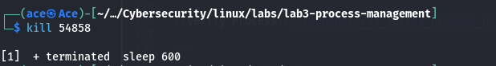

---

## Step 5 — Verify Process Termination

Command:

```
ps aux | grep sleep
```

Explanation:

After terminating the process, the `ps` command can be used to confirm that the process is no longer running.

Example output:

```
ace 56562 0.0 0.0 6544 2504 pts/1 S+ grep --color=auto sleep
```

The only process shown is the `grep` command itself, which confirms that the `sleep` process has been successfully terminated.

Screenshot:

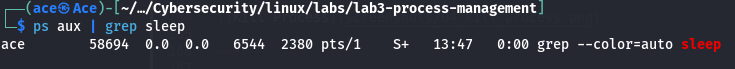

---

> **Note:**
> The screenshot numbering continues from the previous steps already documented in this lab.
> Earlier screenshots (01–05) correspond to creating, inspecting, and terminating the background process.
> The following steps introduce additional process monitoring and management tools such as `top`, `htop`, `killall`, `pkill`, and process priority commands.
> Screenshot numbering therefore continues sequentially from **06 onward** to maintain chronological order in the lab documentation.

## Step 6 — Monitor Processes with `top`

Command:

```
top
```

Explanation:

The `top` command provides a **real-time view of running processes** and system resource usage.

It continuously updates the display to show:

- CPU usage
- memory usage
- system load
- number of running tasks
- active processes

This allows administrators to monitor system activity and identify processes that consume excessive resources.

The display refreshes automatically every few seconds.

To exit `top`, press:

```
q
```

Screenshot:

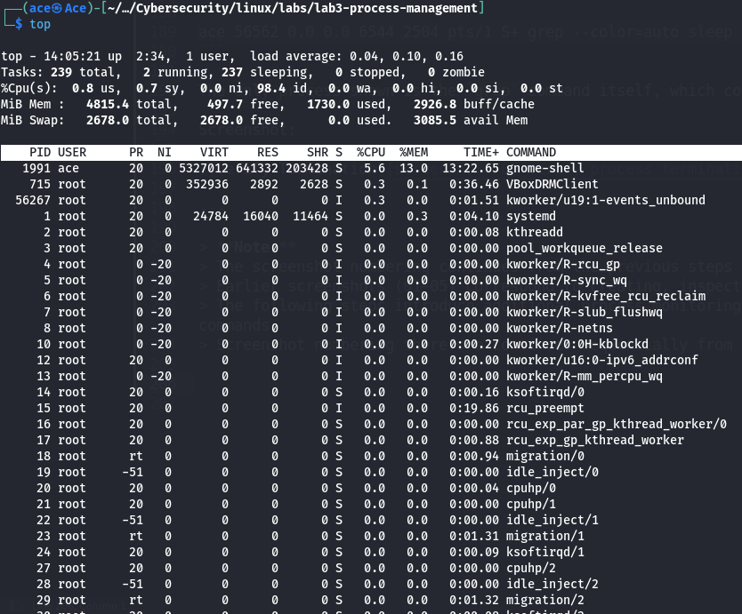

---

## Step 7 — Monitor Processes with `htop`

Command:

```
htop
```

Explanation:

`htop` is an advanced interactive process viewer for Linux.  
It provides a more user-friendly interface compared to the `top` command.

`htop` displays:

- CPU usage for each processor core
- memory usage
- swap usage
- running processes
- system load and uptime

Unlike `top`, `htop` allows users to scroll through processes, search for processes, and terminate processes directly from the interface.

Common controls in `htop` include:

| Key | Function |
|----|----|
F3 | Search for a process |
F5 | Toggle tree view |
F9 | Kill selected process |
F10 | Exit `htop` |

To exit the program, press:

```
q
```

or

```
F10
```

Screenshot:

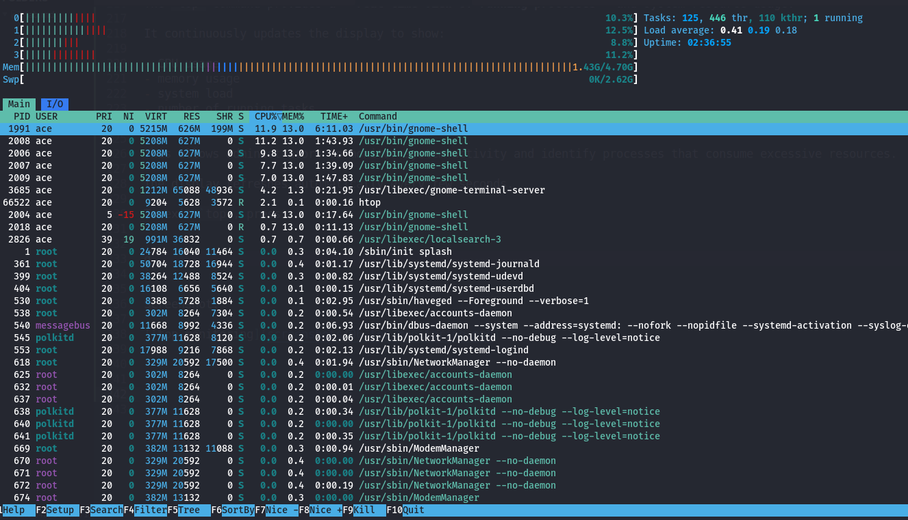

---

## Step 8 — Terminate Processes with `killall`

Commands:

```
sleep 600 &
killall sleep
```

Explanation:

The `killall` command terminates processes by their **name** rather than their Process ID (PID).

In this example, a background process is first created using the `sleep` command.  
The `killall sleep` command then terminates all processes with the name **sleep**.

This method is useful when multiple instances of the same process are running and their PIDs are not known.

Example:

```
killall sleep
```

This command stops all running `sleep` processes on the system.

Screenshot:

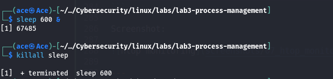

---

## Step 9 — Terminate Processes with `pkill`

Commands:

```
sleep 600 &
pkill sleep
```

Explanation:

The `pkill` command terminates processes based on **name patterns** rather than Process IDs.

In this example, a background `sleep` process is created and then terminated using `pkill`.

Unlike `killall`, `pkill` allows more advanced filtering such as:

- terminating processes by user
- terminating processes by terminal
- matching partial process names

Example:

```
pkill sleep
```

This command stops any running processes whose name matches **sleep**.

Screenshot:

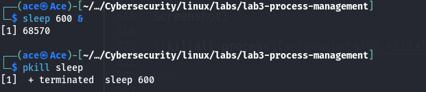

---

## Step 10 — Resume Background Jobs with `fg` and `bg`

Commands:

```
sleep 600
CTRL + Z
bg
```

Explanation:

Linux provides **job control**, allowing processes to be paused and resumed.

In this step:

1. A foreground process is started using the `sleep` command.
2. The process is suspended using **CTRL + Z**.
3. The `bg` command resumes the suspended process in the **background**.

Example output after pressing **CTRL + Z**:

```
[1]+ Stopped sleep 600
```

To bring the process back to the foreground, the `fg` command can be used:

```
fg
```

This allows administrators to move processes between the foreground and background as needed.

Screenshot:

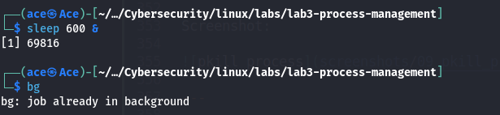

---

## Step 11 — Change Process Priority with `nice`

Command:

```
nice -n 10 sleep 600 &
```

Explanation:

The `nice` command starts a process with a specified **priority level**.

Linux uses a scheduling priority system called the **niceness value**, which determines how much CPU time a process receives compared to others.

Niceness values range from:

```
-20 (highest priority)
19 (lowest priority)
```

In this example:

```
nice -n 10
```

starts the `sleep` process with a **lower priority**, meaning it will receive fewer CPU resources if the system becomes busy.

This is useful when running long tasks that should not interfere with critical system operations.

Screenshot:

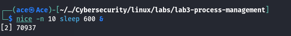

---

## Step 12 — Modify Process Priority with `renice`

Commands:

```
ps aux | grep sleep
renice 5 -p 69816
```

Explanation:

The `renice` command is used to change the **priority of a running process**.

First, the `ps` command is used to locate the Process ID (PID) of the running process.

The `renice` command is then used to adjust the priority of that process.

Example:

```
renice 5 -p 69816
```

This changes the process priority to **5**.

Unlike `nice`, which sets the priority when starting a process, `renice` modifies the priority of an **already running process**.

Screenshot:

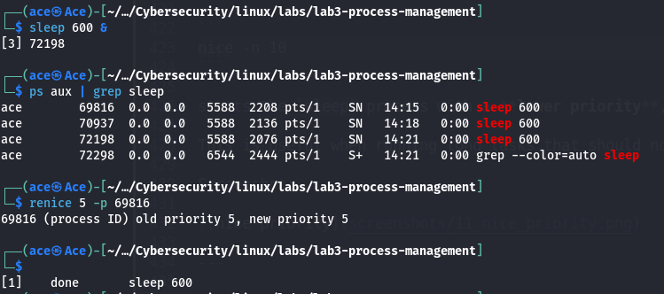

---

## Conclusion

In this lab, we explored how Linux manages processes and how administrators can monitor and control them.

We used several important commands including `ps`, `top`, and `htop` to monitor running processes and system resource usage. We also learned how to control processes using commands such as `kill`, `killall`, and `pkill`.

Additionally, we explored job control using `jobs`, `bg`, and `fg`, which allows processes to be moved between the foreground and background.

Finally, we examined process priority using the `nice` and `renice` commands, which allow administrators to influence how CPU resources are allocated among processes.

Understanding process management is essential for Linux administration and cybersecurity, as all programs and services running on a system operate as processes.
