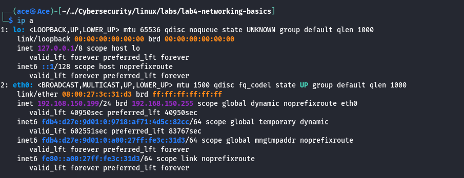
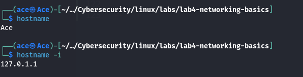
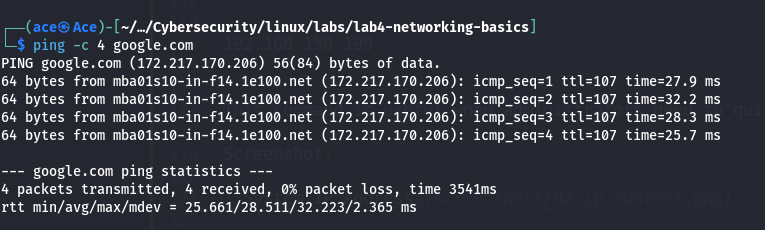
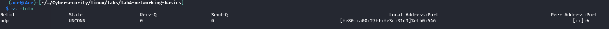
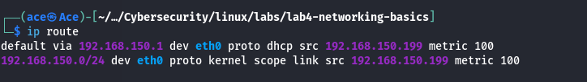
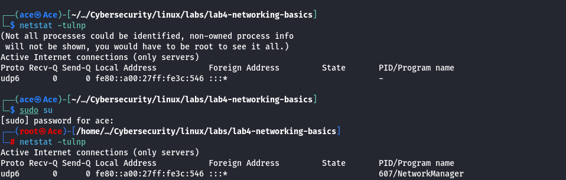
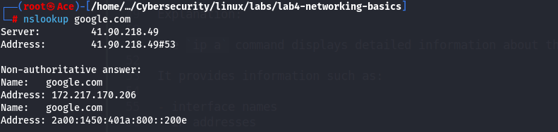
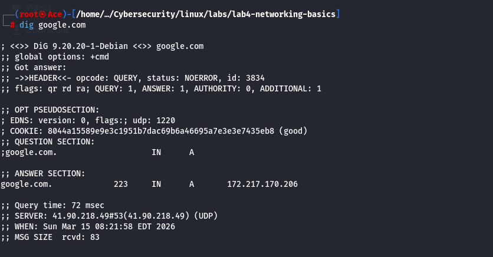
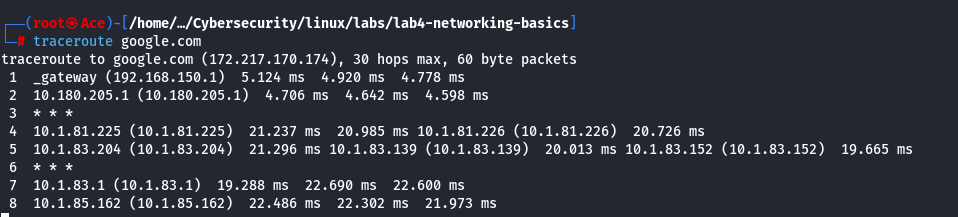
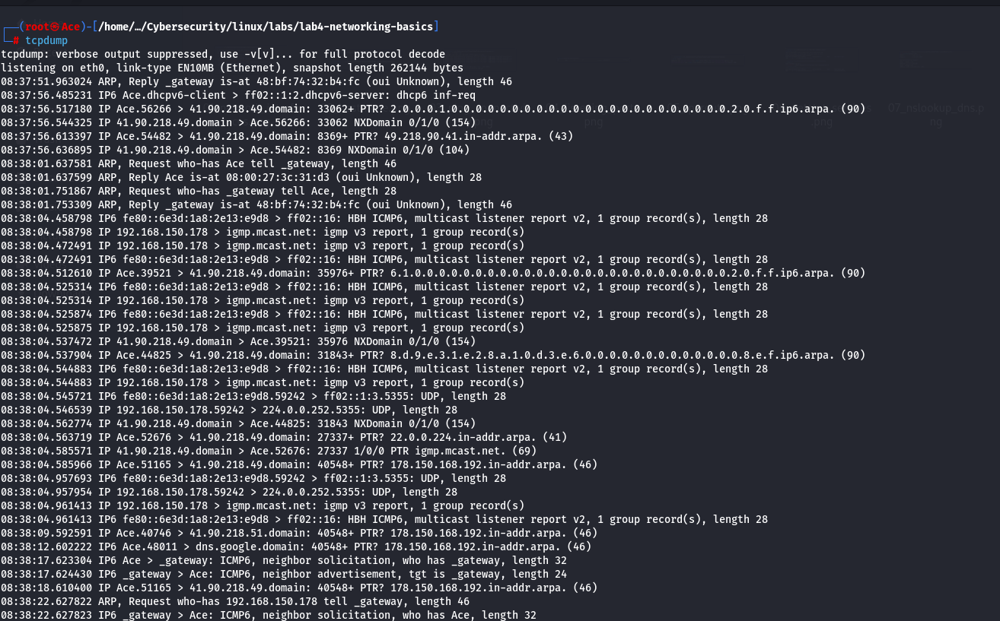

# Lab 4 — Linux Networking Basics

## Introduction

Linux systems rely heavily on networking to communicate with other machines and services. Understanding how to inspect network interfaces, identify IP addresses, and test connectivity is essential for Linux administrators and cybersecurity professionals.

Networking knowledge is critical in cybersecurity because many attacks, defenses, and monitoring techniques depend on understanding how systems communicate across networks.

In this lab, we explore fundamental Linux networking commands used to inspect network configuration and connectivity.

---

## Objective

The objective of this lab is to understand how Linux networking works and how administrators can inspect and diagnose network configurations.

By completing this lab, you will learn how to:

- inspect network interfaces
- identify system IP addresses
- test network connectivity
- inspect open ports
- analyze DNS resolution
- trace network routes

---

## Table of Contents

- [Introduction](#introduction)
- [Objective](#objective)

- [Step 1 — Inspect Network Interfaces](#step-1--inspect-network-interfaces)
- [Step 2 — Identify System Hostname](#step-2--identify-system-hostname)
- [Step 3 — Identify System IP Address](#step-3--identify-system-ip-address)
- [Step 4 — Test Network Connectivity](#step-4--test-network-connectivity)
- [Step 5 — View Listening Network Services](#step-5--view-listening-network-services)
- [Step 6 — Inspect Network Services with netstat](#step-6--inspect-network-services-with-netstat)
- [Step 7 — View the System Routing Table](#step-7--view-the-system-routing-table)
- [Step 8 — Perform DNS Lookup with nslookup](#step-8--perform-dns-lookup-with-nslookup)
- [Step 9 — Perform Advanced DNS Lookup with dig](#step-9--perform-advanced-dns-lookup-with-dig)
- [Step 10 — Trace Network Route](#step-10--trace-network-route)
- [Step 11 — Capture Network Traffic](#step-11--capture-network-traffic)

- [Conclusion](#conclusion)
---

# Step 1 — Inspect Network Interfaces

Command:

ip a

Explanation:

The `ip a` command displays detailed information about the network interfaces on a Linux system.

It provides information such as:

- interface names
- IP addresses
- interface status
- MAC addresses
- network configuration

Example output (simplified):

1: lo: <LOOPBACK,UP,LOWER_UP>
inet 127.0.0.1/8

2: eth0: <BROADCAST,MULTICAST,UP,LOWER_UP>
inet 192.168.150.199/24

Explanation of key fields:

| Field | Meaning |
|------|------|
| `lo` | Loopback interface used for internal system communication |
| `eth0` | Primary network interface connected to the network |
| `inet` | IPv4 address assigned to the interface |
| `192.168.150.199` | Local network IP address |
| `/24` | Subnet mask |

The loopback interface (`lo`) always has the address:

127.0.0.1

This address allows the system to communicate with itself and is commonly used for testing and internal services.

The `eth0` interface represents the actual network interface used to communicate with other machines on the network.

Screenshot:

---

# Step 2 — Identify System Hostname

Commands:

hostname
hostname -i

Explanation:

The `hostname` command displays the **name of the system** on the network.  
Hostnames are used to identify machines within a network and are often used instead of IP addresses when connecting to systems.

Example output:

Ace

In this example, the hostname of the system is **Ace**.

---

### Display Host IP Address

The `hostname -i` command displays the **IP address associated with the system hostname**.

Example output:

127.0.1.1

Explanation:

| Value | Meaning |
|------|------|
| `127.0.1.1` | Loopback IP address associated with the hostname |

The **127.0.0.0/8 range** is reserved for **loopback addresses**, which allow a system to communicate with itself.

This is different from the network IP address assigned to the machine's network interface (which we viewed earlier using `ip a`).

The hostname IP entry is typically defined in the system file:

/etc/hosts

Example entry from `/etc/hosts`:

127.0.1.1 Ace

This file maps hostnames to IP addresses for **local system resolution**.

---

### Security Relevance

Understanding hostnames and local IP mappings is important in cybersecurity because:

- systems on internal networks often communicate using hostnames
- attackers may inspect `/etc/hosts` for internal infrastructure information
- incorrect hostname mappings can affect network communication

---

Screenshot:

---

# Step 3 — Test Network Connectivity

Command:

ping -c 4 google.com

Explanation:

The `ping` command is used to test network connectivity between the local machine and a remote host. It sends **ICMP (Internet Control Message Protocol) Echo Request packets** to the destination host and waits for a reply.

If the remote host responds, it confirms that the system can communicate with that host over the network.

The option:

-c 4

tells the `ping` command to send **four packets** and then stop automatically. Without this option, `ping` would continue sending packets indefinitely until manually stopped using `CTRL + C`.

Example output:

PING google.com (172.217.170.206) 56(84) bytes of data.
64 bytes from mba01s10-in-f14.1e100.net (172.217.170.206): icmp_seq=1 ttl=107 time=27.9 ms
64 bytes from mba01s10-in-f14.1e100.net (172.217.170.206): icmp_seq=2 ttl=107 time=32.2 ms
64 bytes from mba01s10-in-f14.1e100.net (172.217.170.206): icmp_seq=3 ttl=107 time=28.3 ms
64 bytes from mba01s10-in-f14.1e100.net (172.217.170.206): icmp_seq=4 ttl=107 time=25.7 ms

--- google.com ping statistics ---
4 packets transmitted, 4 received, 0% packet loss, time 3541ms
rtt min/avg/max/mdev = 25.661/28.511/32.223/2.365 ms

Explanation of important fields:

| Field | Meaning |
|------|------|
| `icmp_seq` | Packet sequence number |
| `ttl` | Time To Live indicating packet lifespan |
| `time` | Round-trip time for the packet |

The final statistics section shows important connectivity information:

| Metric | Meaning |
|------|------|
| `packets transmitted` | Number of packets sent |
| `received` | Number of packets returned |
| `packet loss` | Percentage of packets lost during transmission |
| `rtt` | Round-trip time statistics |

In this example:

- 4 packets were sent
- 4 packets were received
- 0% packet loss occurred

This confirms that the system has **successful internet connectivity** and can communicate with the remote host.

The `ping` command is commonly used for:

- verifying internet connectivity
- testing host availability
- diagnosing network latency
- troubleshooting network issues

Screenshot:

---

# Step 4 — View Listening Network Services

Command:

ss -tuln

Explanation:

The `ss` command is used to display **socket statistics and network connections**. It is the modern replacement for the older `netstat` command and is commonly used to inspect network activity on Linux systems.

In cybersecurity and system administration, this command helps identify:

- open network ports
- active services
- potential attack surfaces on a system

The options used in this command are:

| Option | Meaning |
|------|------|
| `-t` | Display TCP sockets |
| `-u` | Display UDP sockets |
| `-l` | Show listening sockets |
| `-n` | Display numerical addresses instead of resolving hostnames |

Example output:

Netid State Recv-Q Send-Q Local Address:Port Peer Address:Port
udp UNCONN 0 0 [fe80::a00:27ff:fe3c:31d3]%eth0:546 [::]:*

Explanation of the fields:

| Field | Meaning |
|------|------|
| `Netid` | Network protocol used (TCP or UDP) |
| `State` | State of the socket connection |
| `Recv-Q` | Number of packets waiting to be received |
| `Send-Q` | Number of packets waiting to be sent |
| `Local Address:Port` | Address and port on the local machine |
| `Peer Address:Port` | Remote endpoint |

In this example:

udp UNCONN ... :546

This indicates:

- A **UDP service** is running on the system.
- The service is listening on **port 546**.
- The state **UNCONN** means the socket is not currently connected to a remote peer.

Port **546** is typically used by **DHCPv6 clients**, which automatically obtain IPv6 network configuration from a DHCP server.

From a security perspective, commands such as `ss -tuln` are extremely important because they allow administrators and security analysts to:

- identify services exposed on a system
- detect unauthorized services
- inspect open ports that attackers may attempt to exploit

Screenshot:

# Step 5 — View the System Routing Table

Command:

ip route

Explanation:

The `ip route` command displays the **Linux routing table**, which determines how network packets are forwarded to other networks.

Every time a system sends data to another host, the operating system consults the routing table to decide **which network interface and gateway should be used**.

The routing table is therefore a critical component of network communication.

Example output:

default via 192.168.150.1 dev eth0 proto dhcp src 192.168.150.199 metric 100
192.168.150.0/24 dev eth0 proto kernel scope link src 192.168.150.199 metric 100

Explanation of the routing entries:

### Default Route

default via 192.168.150.1 dev eth0 proto dhcp src 192.168.150.199 metric 100

This line represents the **default gateway** used for internet communication.

| Field | Meaning |
|------|------|
| `default` | Destination for all unknown networks |
| `via 192.168.150.1` | Gateway used to reach external networks |
| `dev eth0` | Network interface used for the route |
| `proto dhcp` | Route assigned automatically by DHCP |
| `src 192.168.150.199` | Local IP address used for outgoing packets |
| `metric 100` | Route priority value |

In this configuration, any traffic destined for external networks is forwarded to the router **192.168.150.1** through the **eth0** interface.

---

### Local Network Route

192.168.150.0/24 dev eth0 proto kernel scope link src 192.168.150.199 metric 100

This entry represents the **local network segment**.

| Field | Meaning |
|------|------|
| `192.168.150.0/24` | Local subnet |
| `dev eth0` | Network interface handling the traffic |
| `proto kernel` | Route created by the Linux kernel |
| `scope link` | Network is directly reachable |
| `src 192.168.150.199` | Local machine IP address |

This means that any device within the **192.168.150.0/24** subnet can be reached directly through the **eth0 network interface** without needing a gateway.

---

### Security Relevance

Understanding routing tables is important for cybersecurity because they reveal:

- network topology
- default gateways
- internal subnet structure
- potential pivoting routes in penetration testing

Attackers and security analysts frequently inspect routing tables to understand **how a system communicates with other networks**.

---

Screenshot:

---

# Step 6 — Inspect Network Services with netstat

Command:

netstat -tulnp

Explanation:

The `netstat` command displays **network connections, listening ports, and associated processes**.

This command is commonly used in system administration and cybersecurity to identify:

- running network services
- open ports
- processes associated with network activity

The options used in this command are:

| Option | Meaning |
|------|------|
| `-t` | Display TCP connections |
| `-u` | Display UDP connections |
| `-l` | Show listening services |
| `-n` | Display numerical addresses |
| `-p` | Show the process ID (PID) and program name |

---

### Running as a Normal User

Command:

netstat -tulnp

Example output:

(Not all processes could be identified, non-owned process info will not be shown,
you would have to be root to see it all.)

Active Internet connections (only servers)
Proto Recv-Q Send-Q Local Address Foreign Address State PID/Program name
udp6 0 0 fe80::a00:27ff:fe3c:546 :::* -

Explanation:

When executed as a **regular user**, the system cannot display process information for services owned by other users or by the system.

Therefore, the `PID/Program name` field appears as:

This is a security feature in Linux that restricts visibility of system processes.

---

### Running with Root Privileges

Command:

sudo su
netstat -tulnp

Example output:

Active Internet connections (only servers)
Proto Recv-Q Send-Q Local Address Foreign Address State PID/Program name
udp6 0 0 fe80::a00:27ff:fe3c:546 :::* 607/NetworkManager

Explanation:

Running the command with **root privileges** reveals the full process information.

From this output we can see:

| Field | Meaning |
|------|------|
| `udp6` | UDP service using IPv6 |
| `:546` | Port number |
| `607` | Process ID |
| `NetworkManager` | Service responsible for the network connection |

Port **546** is used by the **DHCPv6 client**, which is responsible for automatically obtaining network configuration.

The service handling this request is **NetworkManager**, a Linux system service that manages network connections.

---

### Security Relevance

Commands like `netstat` help administrators and security analysts:

- identify active services
- detect suspicious network activity
- analyze exposed network ports
- audit system services

Attackers often perform **port scanning** during reconnaissance to gather similar information from remote systems.

---

Screenshot:

---

# Step 7 — Perform DNS Lookup

Command:

nslookup google.com

Explanation:

The `nslookup` command is used to query **Domain Name System (DNS) servers** to resolve domain names into IP addresses.

DNS is responsible for translating human-readable domain names (such as `google.com`) into machine-readable IP addresses that computers use to communicate on the network.

Example output:

Server: 41.90.218.49
Address: 41.90.218.49#53

Non-authoritative answer:
Name: google.com
Address: 172.217.170.206
Name: google.com
Address: 2a00:1450:401a:800::200e

Explanation of the output:

| Field | Meaning |
|------|------|
| `Server` | DNS server used for the query |
| `Address` | IP address of the DNS server |
| `Non-authoritative answer` | The response came from a cached DNS server |
| `Name` | The domain name queried |
| `Address` | IP addresses associated with the domain |

In this example:

- The DNS server used was **41.90.218.49**
- The domain **google.com** resolved to the IPv4 address:

172.217.170.206

and the IPv6 address:

2a00:1450:401a:800::200e

This confirms that the system successfully queried a DNS server and resolved the domain name into its corresponding IP addresses.

---

### Security Relevance

DNS queries are very important in cybersecurity because they reveal:

- domain-to-IP mappings
- network infrastructure
- external services used by a system

Attackers often perform DNS enumeration to discover:

- subdomains
- internal hosts
- hidden services

Security analysts also monitor DNS queries to detect **malicious domains or command-and-control communication**.

---

Screenshot:

---

# Step 9 — Perform Advanced DNS Lookup with dig

Command:

dig google.com

Explanation:

The `dig` command (Domain Information Groper) is an advanced DNS query tool used to retrieve detailed information about DNS records.

It is commonly used by system administrators, network engineers, and cybersecurity professionals to investigate DNS resolution issues and analyze domain records.

Example output:

; <<>> DiG 9.20.20-1-Debian <<>> google.com
;; ->>HEADER<<- opcode: QUERY, status: NOERROR

;; QUESTION SECTION:
;google.com. IN A

;; ANSWER SECTION:
google.com. 223 IN A 172.217.170.206

;; Query time: 72 msec
;; SERVER: 41.90.218.49#53(41.90.218.49) (UDP)

Explanation of important sections:

### HEADER Section

status: NOERROR

This indicates that the DNS query was successful and the server returned a valid response.

---

### QUESTION SECTION

;google.com. IN A

| Field | Meaning |
|------|------|
| `google.com` | Domain name queried |
| `IN` | Internet DNS class |
| `A` | Query for IPv4 address |

---

### ANSWER SECTION

google.com. 223 IN A 172.217.170.206

| Field | Meaning |
|------|------|
| `google.com` | Domain name |
| `223` | Time To Live (TTL) in seconds |
| `A` | Record type |
| `172.217.170.206` | IPv4 address returned |

This confirms that the domain **google.com resolves to the IP address 172.217.170.206**.

---

### DNS Server Used

SERVER: 41.90.218.49#53

This indicates that the DNS server **41.90.218.49** handled the query on port **53**, which is the standard DNS port.

---

### Query Performance

Query time: 72 msec

This represents the time it took for the DNS server to respond to the query.

---

### Security Relevance

The `dig` command is extremely useful in cybersecurity because it allows analysts to:

- investigate DNS records
- identify infrastructure used by domains
- perform DNS reconnaissance
- detect DNS misconfigurations
- analyze potential malicious domains

Attackers often use DNS queries during reconnaissance to gather information about a target organization's infrastructure.

---

Screenshot:

---

# Step 10 — Trace Network Route

Command:

traceroute google.com

Explanation:

The `traceroute` command displays the path that packets take from the local system to a destination host. It shows each intermediate router (known as a **hop**) that the packets pass through on their way to the destination.

This command works by sending packets with gradually increasing **TTL (Time To Live)** values. Each router along the path decreases the TTL value until it reaches zero, causing the router to return a response. This process allows traceroute to identify every hop in the route.

Example output:

traceroute to google.com (172.217.170.174), 30 hops max, 60 byte packets
1 _gateway (192.168.150.1) 5.124 ms 4.920 ms 4.778 ms
2 10.180.205.1 (10.180.205.1) 4.706 ms 4.642 ms 4.598 ms
3 * * *
4 10.1.81.225 (10.1.81.225) 21.237 ms 20.985 ms 10.1.81.226 (10.1.81.226) 20.726 ms
5 10.1.83.204 (10.1.83.204) 21.296 ms 10.1.83.139 (10.1.83.139) 20.013 ms 10.1.83.152 (10.1.83.152) 19.665 ms
6 * * *
7 10.1.83.1 (10.1.83.1) 19.288 ms 22.690 ms 22.600 ms
8 10.1.85.162 (10.1.85.162) 22.486 ms 22.302 ms 21.973 ms
9 10.32.0.114 (10.32.0.114) 21.844 ms 21.684 ms 21.573 ms

Explanation of key fields:

| Field | Meaning |
|------|------|
| Hop number | The position of the router in the path |
| Hostname/IP | Router handling the packet |
| `ms` values | Round-trip time for the packet |

Hop analysis:

**Hop 1**

_gateway (192.168.150.1)

This is the **local gateway**, which is typically the home or office router responsible for forwarding traffic to external networks.

**Hop 2**

10.180.205.1

This is likely part of the **Internet Service Provider (ISP) infrastructure** that handles traffic leaving the local network.

**Hop 3 and 6**

Asterisks indicate that the router **did not respond to traceroute probes**. This commonly occurs when routers block ICMP responses for security reasons.

**Hops 4–9**

These represent additional routers within the **ISP or backbone network** that are forwarding packets toward the final destination.

---

### Security Relevance

The `traceroute` command is useful in cybersecurity because it helps analysts:

- identify network infrastructure
- detect routing anomalies
- map intermediate network devices
- troubleshoot connectivity issues

Attackers may also use traceroute during **reconnaissance** to learn about the network path between systems.

---

Screenshot:

---

# Step 11 — Capture Network Traffic

Command:

tcpdump -i eth0

Explanation:

The `tcpdump` command is a powerful packet analyzer used to capture and inspect network traffic in real time. It allows administrators and security analysts to observe packets traveling through a network interface.

The option used in this command:

| Option | Meaning |
|------|------|
| `-i eth0` | Capture packets on the `eth0` network interface |

When the command starts, it listens on the selected interface and prints packet information as traffic flows through the network.

Example output:

tcpdump: verbose output suppressed, use -v[v]... for full protocol decode
listening on eth0, link-type EN10MB (Ethernet), snapshot length 262144 bytes
08:37:51.963024 ARP, Reply _gateway is-at 48:bf:74:32:b4:fc, length 46
08:37:56.517180 IP Ace.56266 > 41.90.218.49.domain: PTR? ...
08:38:01.751867 ARP, Request who-has _gateway tell Ace
08:38:04.458798 IP 192.168.150.178 > igmp.mcast.net: igmp v3 report
08:38:17.624430 IP6 _gateway > Ace: ICMP6, neighbor advertisement

Explanation of captured packets:

| Protocol | Description |
|------|------|
| **ARP** | Address Resolution Protocol used to map IP addresses to MAC addresses |
| **IP / UDP** | Standard network packet carrying application data |
| **DNS (domain)** | Domain Name System queries resolving hostnames |
| **ICMP / ICMPv6** | Network diagnostic messages used for connectivity checks |
| **IGMP** | Internet Group Management Protocol used for multicast communication |

Example packet interpretation:

ARP, Reply _gateway is-at 48:bf:74:32:b4:fc

This indicates that the network gateway is responding with its **MAC address**, allowing the system to communicate with it at the Ethernet layer.

Another example:

IP Ace.56266 > 41.90.218.49.domain

This indicates that the system **Ace** is communicating with a **DNS server** on port 53.

---

### Security Relevance

The `tcpdump` tool is widely used in cybersecurity because it allows analysts to:

- monitor network activity
- detect suspicious traffic
- investigate network attacks
- analyze malware communication
- inspect DNS queries and responses

Packet capture tools are fundamental in **incident response, network forensics, and penetration testing**.

---

### Stopping tcpdump

Since `tcpdump` runs continuously, it can be stopped by pressing:

CTRL + C

---

Screenshot:

---

# Conclusion

In this lab, we explored several essential Linux networking commands used to inspect and troubleshoot network connectivity.

The lab began by examining network interfaces using the `ip a` command, which revealed the system's network configuration and assigned IP addresses. We then identified the system hostname and associated loopback address using the `hostname` and `hostname -i` commands.

Next, network connectivity was verified using the `ping` command, which confirmed that the system could successfully communicate with external hosts. The `ss` and `netstat` commands were then used to inspect listening network services and open ports, allowing us to identify services running on the system.

The routing configuration of the system was examined using the `ip route` command, which displayed the routing table and default gateway responsible for forwarding network traffic.

DNS resolution was demonstrated using both `nslookup` and `dig`, which translated the domain name `google.com` into its corresponding IP addresses. This illustrated how domain names are resolved into network addresses during normal internet communication.

The `traceroute` command was used to analyze the path packets take through the network to reach a destination host. This provided insight into the intermediate routers involved in delivering network traffic.

Finally, the `tcpdump` tool was used to capture live network packets, demonstrating how network traffic can be monitored and analyzed in real time.

Together, these commands provide powerful tools for system administrators and cybersecurity professionals to investigate network configuration, troubleshoot connectivity issues, monitor services, and analyze network traffic.

Understanding these tools is fundamental for Linux administration, network troubleshooting, penetration testing, and incident response.

---

